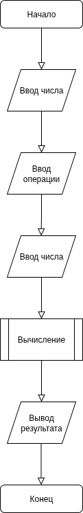

# Простой калькулятор

## Описание
Это простая консольная программа-калькулятор, реализованная на Python. Она выполняет базовые арифметические операции.

## Функциональность
- Сложение
- Вычитание
- Умножение
- Деление

## Требования
* Python 3.6 или выше

## Установка и запуск
1. Склонируйте репозиторий: `git clone https://github.com/reallyinflexed/calculator.git`
2. Перейдите в папку проекта: `cd calculator`
3. Запустите программу: `python Calc.py`

## Алгоритм работы

